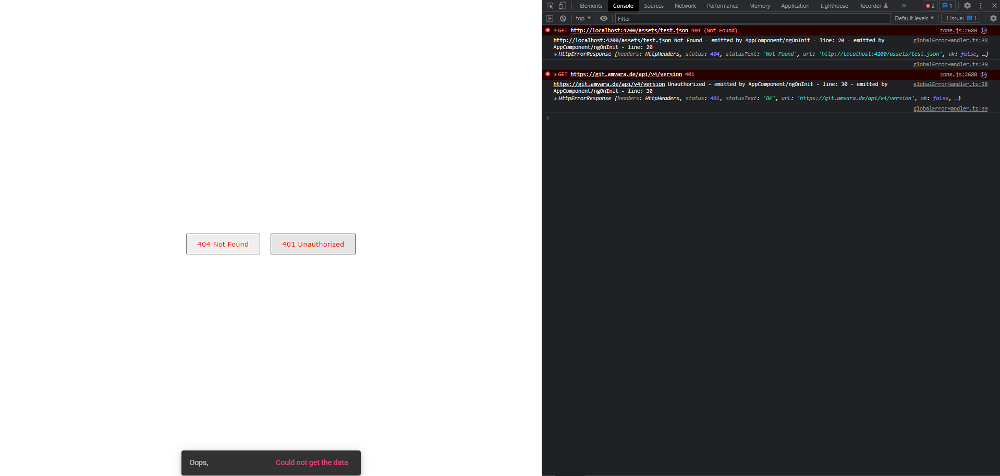

# ErrorHandler

This project was generated with [Angular CLI](https://github.com/angular/angular-cli) version 13.1.3.

## Development server

Run `ng serve` for a dev server. Navigate to `http://localhost:4200/`. The app will automatically reload if you change any of the source files.

## Code scaffolding

Run `ng generate component component-name` to generate a new component. You can also use `ng generate directive|pipe|service|class|guard|interface|enum|module`.

## Build

Run `ng build` to build the project. The build artifacts will be stored in the `dist/` directory.

## Running unit tests

Run `ng test` to execute the unit tests via [Karma](https://karma-runner.github.io).

## Running end-to-end tests

Run `ng e2e` to execute the end-to-end tests via a platform of your choice. To use this command, you need to first add a package that implements end-to-end testing capabilities.

## Further help

To get more help on the Angular CLI use `ng help` or go check out the [Angular CLI Overview and Command Reference](https://angular.io/cli) page.
#


&nbsp;<br>&nbsp;<br>&nbsp;<br>&nbsp;<br>&nbsp;<br>&nbsp;<br>
# `Catch all the error in a single global error handler - ANGULAR errorHandler` #


### Are you tired of writing error handler on every http call? are you tired of catching run time errors? are you tired of not being able try/catch asynchronous code?
&nbsp;<br>
### In this post, we are going to talk about how to create single, global, centralized, efficient error handler for whole project, once and for all.
&nbsp;<br>
### First things first, let's talk about Angular ErrorHander and what it has to offer us.
&nbsp;<br>

### Angular ErrorHandler, provides a way for us to actually centralize exception catching and handling. So if we just implement a very basic version of it, it will catch all the expections for us.

&nbsp;<br>
### Let's go ahead and create a class `globalErrorHandler/globalErrorHandler.ts` 

```javascript
class globalErrorHandler implements ErrorHandler {
  handleError(error) {

  }
}
```

### In order for our customErrorHandler class to kick in, we need to `provide it in app.module.ts`

```javascript
providers: [
    { provide: ErrorHandler, useClass: globalErrorHandler },
]
```

### This is enought to catch all the errors, **BUT** we don't want to implement it just like this, we need to adequately treat an error.
&nbsp;<br>
### Why? Well there are couple of reasons.
### <li> User experience - First of all, we don't want our users seeing an error they can't understand. We want our user to see a nice message when some error is fired and we ourselves want to see an ugly error.</li> ###
          
### <li>Error tracking and of course, we want to get as much information as possible from the handler, because we want to be able to track and eliminate the problem as fast as possible. Being able to provide a global, centralized error handling, by default Angular errorHandler lacks error tracking. Angular gives us a way to implement it in our way, so we can adapt it to our needs. </li>

&nbsp;<br>&nbsp;<br>&nbsp;<br>&nbsp;<br>
### So let's add more managment and give our error handler a personal touch.
&nbsp;<br>
### Create `customSelectors/error.selector.ts` file and export error messages - This will help us to provide adequate feedback for the developers, allowing them to track error faster.
&nbsp;<br>
### You can implement this file to your preference and provide data, for now let's just export it.
&nbsp;<br>

```javascript
export const errors: any = {
    400:"Bad Request",
    401:"Unauthorized",
    402:"Payment Required",
    403:"Forbidden",
    404:"Not Found",
    405:"Method Not Allowed",
    406:"Not Acceptable",
    407:"Proxy Authentication Required",
    408:"Request Timeout",
    409:"Conflict",
    410:"Gone",
    411:"Length Required",
    412:"Precondition Failed",
    413:"Payload Too Large",
    414:"URI Too Long",
    415:"Unsupported Media Type",
    416:"Range Not Satisfiable",
    417:"Expectation Failed",
    418:"I'm a Teapot",
    421:"Misdirected Request",
    422:"Unprocessable Entity",
    423:"Locked",
    424:"Failed Dependency",
    425:"Too Early",
    426:"Upgrade Required",
    428:"Precondition Required",
    429:"Too Many Requests",
    431:"Request Header Fields Too Large",
    451:"Unavailable For Legal Reasons",
    500:"Internal Server Error",
    501:"Not Implemented",
    502:"Bad Gateway",
    503:"Service Unavailable",
    504:"Gateway Timeout",
    505:"HTTP Version Not Supported",
    506:"Variant Also Negotiates",
    507:"Insufficient Storage",
    508:"Loop Detected",
    510:"Not Extended",
    511:"Network Authentication Required"
}

export const setErroCodeMessage = (code: number, message: string) => {
    errors[code] +=  ` - ${message}`;
}
```

### We can also refactor this .ts file and  instead of exporting string message, export an object for each status code key, but for now let's continue with this.
&nbsp;<br>

### Create `globalErrorHandler/error.service.ts file` - this service will provide for errorHandler adequate message depending on error's status code.
&nbsp;<br>

```javascript
import { Injectable } from '@angular/core';
import { errors } from '../custumSelectors/errors.selector';

@Injectable({
    providedIn: 'root'
})
export class ErrorService {
    getCustomErrorMessage(status: number ): string {
        return errors[status] ? errors[status] : 'Unknown Error';
    }
}
```
&nbsp;<br>


### Now let's implement globalErrorHandler class in a more advanced way.
&nbsp;<br>

```javascript
import { HttpErrorResponse } from "@angular/common/http";
import { ErrorHandler, Injectable, Injector } from "@angular/core";
import { ErrorService } from "./error.service";
import { MatSnackBar } from '@angular/material/snack-bar';
import { NgZone } from "@angular/core";

@Injectable()
export class GlobalErrorHandler implements ErrorHandler {
    errorService: any = null;

    constructor(private injector: Injector, private snackbar: MatSnackBar, private zone: NgZone) {
        this.errorService = this.injector.get(ErrorService);
    }

    handleError(error: any): void {
        this.handle(error);
		
		// todo
		// redirect to 404 page
    }

    private handle(error: any) {
        const notification = this.getNotification(error);
		
		// log for developers
        this.log(error);
		
		// fire snackbar notification for user
        this.notify(notification);
    }


    private notify(notification: any) {
        this.zone.run(() => notification )
    }

    private getNotification(error: any) {
		// get error message for user perspective
        const userMessage = this.getUserFriendlyMessage(error);
		
		// return a snack-bar with user friendly message
        return this.snackbar.open("Oops,", userMessage, {duration: 3000})
    }

    private log(error: any) {
		// get request url if error is of type HttpErrorResponse. If error is from client side, message will be 'This seems to be an issue from our side'
        const techMessage = this.technicalMessage(error);
		
		// get costume, human understandable message
        const customeErrorMessage = this.errorService.getCustomErrorMessage(error.status);
		
		// log both technical error message and custom error message, togather with actual error
        console.log(techMessage, customeErrorMessage, error)
    }

    private getUserFriendlyMessage(error: any) {
        return error instanceof HttpErrorResponse ? 'Could not get the data': 'Server is under maintaince';
    }

    private technicalMessage(error: any) {
        return error instanceof HttpErrorResponse ? <any>error.url: 'This seems to be an issue from our side';
    }
}
```
&nbsp;<br>


### Now, let's go ahead and create a couple of http requests to test the functionality of our just implemented global error Handler in `app.component.ts` and `app.component.html`.
&nbsp;<br>
```html
<div>
    <button (click)="fire404()">404 Not Found</button>
    <button (click)="fire401()">401 Unauthorized</button>
</div>
```
&nbsp;<br>

```javascript
import { HttpErrorResponse } from '@angular/common/http';
import { Component } from '@angular/core';
import { ApiService } from './services/api.service';
import { setErroCodeMessage } from './custumSelectors/errors.selector';

@Component({
  selector: 'app-root',
  templateUrl: './app.component.html',
  styleUrls: ['./app.component.scss']
})
export class AppComponent {
  title = 'errorHandler';

  constructor(private api: ApiService) {}
  
  fire404() {
    this.api.get404().subscribe({
      next: (res) => {},
      error: (err) => {
        setErroCodeMessage(err.status, "emitted by AppComponent/ngOnInit - line: 20")
        throw new HttpErrorResponse(err);
      }
    });
  }

  fire401() {
    this.api.get401().subscribe({
      next: (res) => {},
      error: (err) => {
        setErroCodeMessage(err.status, "emitted by AppComponent/ngOnInit - line: 30")
        throw new HttpErrorResponse(err);
      }
    });
  }
}

```
&nbsp;<br>

## Here is the result
